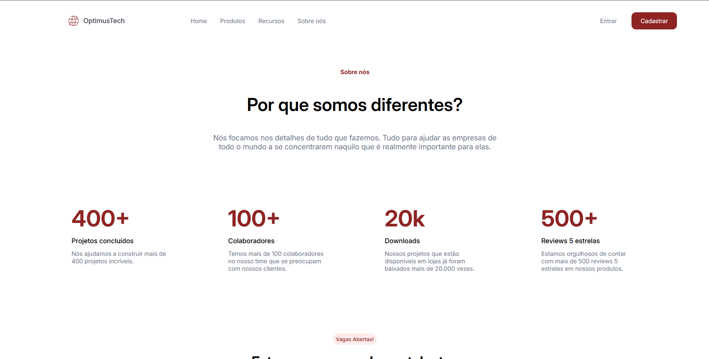
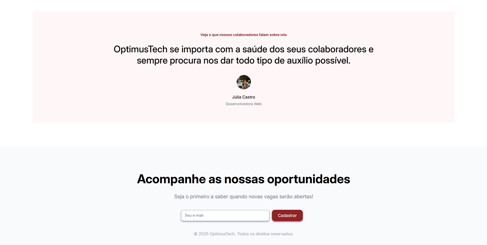

# 🚀 OptimusTech
OptimusTech é uma página web estática desenvolvida com HTML5 e CSS3, com base nos conhecimentos adquiridos nos cursos da Alura. O projeto busca aplicar práticas modernas de desenvolvimento front-end, com foco em estrutura semântica e design responsivo.

# 🧰 Tecnologias Utilizadas
- HTML5
- CSS3

# 📚 Base de Conhecimento
Este projeto foi desenvolvido como parte do processo de aprendizado na plataforma Alura, reforçando conceitos como:

- Estruturação de páginas com HTML semântico

- Estilização com CSS moderno

- Organização de código e boas práticas

# 📷 Prévia

# ▶️ Como Visualizar
Acesse ao link abaixo para visualização do projeto:
https://optimus-tech-topaz.vercel.app/
